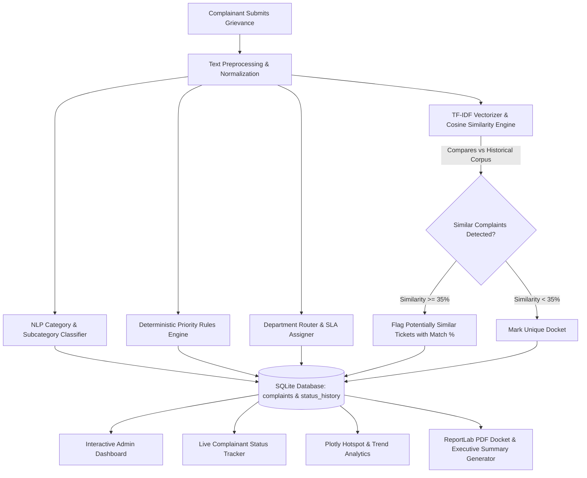

# 🏛️ CivicPulse AI
### Intelligent Complaint Management & Resolution Analytics Platform

[](https://www.python.org/)
[](https://streamlit.io/)
[](https://scikit-learn.org/)
[](https://www.sqlite.org/)
[](https://plotly.com/)
[](https://www.reportlab.com/)
[](https://pytest.org/)

---

## 📌 1. Project Overview & Problem Statement

Educational institutions, universities, corporate campuses, residential complexes, and municipal facilities process hundreds of daily complaints across multiple domains:
- **Electrical failures** (fans, lighting, tripping circuit breakers, air conditioners)
- **Water & plumbing** (burst pipes, overflowing restrooms, RO purifier contamination)
- **Network & IT** (Wi-Fi access point downtime, LAN port faults, classroom projector dropouts)
- **Cleaning & hygiene** (dustbin overflows, pest infestation, unhygienic washrooms)
- **Infrastructure & civil** (broken door locks, cracked window panes, damaged desks)
- **Machinery & safety** (elevator breakdown, dark transit areas, CCTV blind spots)

### The Core Problem
In traditional management systems, grievances are recorded manually or via unindexed spreadsheets. This causes:
1. **Misclassification & routing delays:** Tickets routed to incorrect departments sit in queue for days.
2. **Untracked duplicate submissions:** Multiple individuals submit tickets for the same issue (e.g. 5 students complaining about the same broken fan in *EEE Lab 2*), fragmenting response efforts.
3. **Subjective priority assessment:** Urgent safety hazards (such as sparking wires or water inundation) get buried beneath non-urgent cosmetic requests.
4. **Lack of auditability & hotspot visibility:** Administrators lack data-driven intelligence on recurring failure hotspots or department bottlenecks.

### The CivicPulse AI Solution
**CivicPulse AI** provides a transparent, localized, end-to-end intelligent complaint platform. When a user submits a natural-language complaint, CivicPulse AI automatically cleans the text, extracts key signals, classifies the category and subcategory, deterministically computes priority with human-readable rationale, checks for potentially similar tickets using **TF-IDF Vectorization and Cosine Similarity**, routes the ticket to the designated department, logs an immutable audit trail into SQLite, and provides management dashboards and PDF docket exports.

---

## 🏗️ 2. Architectural Design & How It Works



---

## ⚡ 3. Key Algorithmic Modules & Technical Features

### 🔍 A. NLP Complaint Analyzer (`modules/complaint_analyzer.py`)
- **Text Normalization:** Expands English contractions (`isn't` $\rightarrow$ `is not`), standardizes whitespace, strips punctuation, and extracts n-gram tokens.
- **Domain-Aware Stopword Handling:** Filters filler words (`please`, `kindly`, `sir`, `urgent`) while preserving critical directional and negation tokens (`not`, `down`, `no`, `leak`, `fire`).
- **Modular Taxonomy:** Evaluates token and phrase matches across 8 categories and 30+ fine-grained subcategories with confidence scoring.

### ⚖️ B. Deterministic Priority Engine (`modules/priority_engine.py`)
*Note: This feature is explicitly implemented as a transparent, rule-based engine, not a black-box model.*
- **Critical Signals (Score ~95):** Exposed wires, sparking, electric shock, fire/smoke hazard, burst pipe flooding, elevator passenger entrapment, active security emergencies.
- **High Signals (Score ~75):** Multi-equipment failure, classroom/lab session disruption, exam period impacts, widespread network/Wi-Fi downtime.
- **Medium Signals (Score ~50):** Standard maintenance issues, single-point repairs.
- **Low Signals (Score ~25):** Cosmetic wear, consumable requests (whiteboard markers, dusters), minor squeaks.
- **Explainability:** Returns a `priority_reason` string alongside each rating so administrators and users understand the exact trigger.

### 🧠 C. TF-IDF & Cosine Similarity Engine (`modules/similarity_engine.py`)
- Transforms title, description, and location into TF-IDF unigram and bigram feature vectors (`ngram_range=(1, 2)`, sublinear TF scaling).
- Calculates pairwise cosine similarity against the historical SQLite database corpus:
$$\text{Cosine Similarity}(\mathbf{q}, \mathbf{d}) = \frac{\mathbf{q} \cdot \mathbf{d}}{\|\mathbf{q}\| \|\mathbf{d}\|}$$
- Flags tickets with similarity $\ge 35\%$ as **"Potentially similar complaint"** with percentage scores.
- Applies an intelligent location-match bonus when room/block identifiers align.

### 🏢 D. Department Routing & SLA (`modules/department_router.py`)
- Maps classified categories and subcategories to specialized divisions (e.g. Electrical Division, HVAC Unit, Network Operations, Structural Maintenance, Fire & Safety).
- Computes target SLA response hours (from 4 hours for security to 48 hours for civil requests).

### 🛡️ E. Parameterized Database & Audit Trail (`database/database.py`)
- Thread-safe SQLite management using parameterized SQL queries (`?` syntax) preventing SQL injection.
- Dual-table relational schema:
  - `complaints`: Primary grievance record, timestamps, status, priority, and similarity metadata.
  - `status_history`: Immutable chronological audit logs capturing every status transition (`Pending` $\rightarrow$ `Assigned` $\rightarrow$ `In Progress` $\rightarrow$ `Resolved` $\rightarrow$ `Closed`), technician remarks, and timestamps.
- Automated resolution duration calculation in hours.

### 📊 F. Interactive Analytics & Problem Hotspots (`views/analytics_view.py`)
- Real-time KPI summary counters (Total, Pending, In Progress, Resolved, Critical, Avg Resolution Hours).
- **Problem Hotspot Intelligence:** Discovers the most reported category, most affected room/building, and top bottleneck departments.
- Interactive Plotly charts: Horizontal Category Bar, Priority Donut, Status Breakdown, Location Frequency, and Inflow Trend Area Chart.

### 📄 G. Official PDF Generation (`modules/report_generator.py`)
- **Single Complaint Docket PDF:** Generates official downloadable PDF summary containing complainant details, AI similarity notes, priority justification, and complete status transition audit history.
- **Executive Management Summary PDF:** Generates high-level briefing with KPI tables, category breakdown, priority resolution rates, and actionable hotspot recommendations.

---

## 📂 4. Project Directory Structure

```
CivicPulse-AI/
├── app.py                     # Main Streamlit entrance & modern sidebar navigation
├── requirements.txt           # Lean, audited project dependencies
├── README.md                  # Comprehensive portfolio documentation
├── .gitignore                 # Python & SQLite exclusion rules
│
├── database/
│   ├── __init__.py
│   ├── schema.py              # SQLite DDL schema, table creation, and indexes
│   └── database.py            # SQLite connection, CRUD, parameterized queries, KPIs
│
├── modules/
│   ├── __init__.py
│   ├── text_processing.py     # Contraction expansion, cleaning, stopword filtering, keywords
│   ├── complaint_analyzer.py  # NLP taxonomy classification & subcategory assignment
│   ├── priority_engine.py     # Deterministic priority engine with explainability signals
│   ├── similarity_engine.py   # TF-IDF Vectorizer + Cosine Similarity duplicate detector
│   ├── department_router.py   # Specialized department mapping & SLA calculation
│   └── report_generator.py    # ReportLab PDF docket & executive briefing generator
│
├── views/
│   ├── __init__.py
│   ├── submit_view.py         # Complainant submission form & instant AI analysis card
│   ├── tracker_view.py        # Status lookup by ID/Email with visual timeline & PDF export
│   ├── admin_view.py          # Admin management, multi-filters, status workflow & audit log
│   ├── analytics_view.py      # Plotly charts, KPI metrics & problem hotspot analysis
│   └── reports_view.py        # PDF & CSV reporting center
│
├── data/
│   ├── __init__.py
│   └── sample_data.py         # Realistic sample grievances with duplicate pairs & history
│
├── utils/
│   ├── __init__.py
│   ├── ui_components.py       # Custom CSS tokens, metric cards, status badges, timeline
│   └── validators.py          # Form input validation (email, min length, sanitize)
│
└── tests/
    ├── __init__.py
    ├── test_analyzer.py       # Unit tests for text processing & NLP category classification
    ├── test_priority.py       # Unit tests for priority rules & explainability signals
    ├── test_similarity.py     # Unit tests for TF-IDF Cosine similarity detection
    ├── test_database.py       # Unit tests for SQLite CRUD & status transition history
    └── test_e2e_integration.py# End-to-end full grievance lifecycle integration test
```

---

## 🚀 5. Installation & Setup Guide

### Prerequisites
- Python **3.11** or higher installed.

### Step 1: Clone Repository
```bash
git clone https://github.com/your-username/CivicPulse-AI.git
cd CivicPulse-AI
```

### Step 2: Create and Activate a Virtual Environment
```bash
# Windows
python -m venv venv
.\venv\Scripts\activate

# macOS / Linux
python3 -m venv venv
source venv/bin/activate
```

### Step 3: Install Required Dependencies
```bash
pip install -r requirements.txt
```

### Step 4: Run the Application
```bash
streamlit run app.py
```
Open your browser and navigate to `http://localhost:8501`.

---

## 🧪 6. Running the Automated Test Suite

CivicPulse AI includes a comprehensive test suite covering NLP classification, priority estimation, TF-IDF similarity, SQLite persistence, and full lifecycle execution.

Run all tests via `pytest`:
```bash
pytest -v
```

Expected output:
```text
============================= test session starts =============================
collected 16 items

tests/test_analyzer.py::test_clean_text_contractions_and_whitespace PASSED [  6%]
tests/test_analyzer.py::test_tokenize_stopwords PASSED                   [ 12%]
tests/test_analyzer.py::test_category_classification_electrical PASSED   [ 18%]
tests/test_analyzer.py::test_category_classification_water PASSED        [ 25%]
tests/test_analyzer.py::test_category_classification_network PASSED      [ 31%]
tests/test_analyzer.py::test_keyword_extraction PASSED                   [ 37%]
tests/test_database.py::test_insert_and_get_complaint PASSED             [ 43%]
tests/test_database.py::test_status_update_and_history PASSED            [ 50%]
tests/test_database.py::test_kpis_calculation PASSED                     [ 56%]
tests/test_e2e_integration.py::test_full_complaint_lifecycle PASSED      [ 62%]
tests/test_priority.py::test_priority_critical_fire_and_sparking PASSED  [ 68%]
tests/test_priority.py::test_priority_high_multiple_equipment_disruption PASSED [ 75%]
tests/test_priority.py::test_priority_low_cosmetic PASSED                [ 81%]
tests/test_priority.py::test_priority_medium_default PASSED              [ 87%]
tests/test_similarity.py::test_similarity_detection_positive_pair PASSED [ 93%]
tests/test_similarity.py::test_similarity_empty_existing PASSED          [100%]

============================= 16 passed in 2.53s ==============================
```

---

## 📋 7. Example End-to-End Workflow

1. **Submit Grievance:**
   - User enters: *"Two ceiling fans stopped working in EEE Lab 2 during class."*
   - System auto-detects **Category: Electrical**, **Subcategory: Fan / Ventilation**, **Priority: High**, and **Department: Electrical Maintenance Division**.
   - TF-IDF Vectorizer detects an existing active ticket (*"Three ceiling fans not working in EEE Lab 2"*) and displays: `⚠️ Potential Similar Complaints Found (88% Match)`.
   - Generates Ticket ID `CP-2026-0002`.

2. **Track Live Progress:**
   - Complainant enters `CP-2026-0002` in **Track Complaint**.
   - Views color-coded status badges, assigned department SLA, and visual chronological timeline.
   - Downloads official PDF resolution docket with one click.

3. **Admin Triage & Status Update:**
   - Facility manager opens **Admin Dashboard**.
   - Filters tickets by status `Pending` or priority `High`.
   - Updates status from `Pending` $\rightarrow$ `In Progress` $\rightarrow$ `Resolved` with remarks (*"Capacitor replaced by Eng. Anand"*).
   - Timestamped record is immediately appended to `status_history`.

4. **Hotspot Analysis & Executive Reporting:**
   - Administrator opens **Analytics & Hotspots**.
   - Problem Hotspot Intelligence highlights *Electrical* as top issue (40% of total) and *EEE Lab 2* as the most affected room.
   - Generates and exports executive management PDF briefing.

---

## 🔍 8. Technical Disclosures & Limitations

In accordance with strict portfolio integrity standards:
- **Rule-Based Priority vs. ML:** Priority assignment uses an explicit, deterministic rule engine with signal explainability rather than an opaque classifier.
- **Duplicate Detection:** Similarity analysis uses TF-IDF and Cosine Similarity on text tokens. It labels matches as *"Potentially similar complaint"* and provides percentage confidence rather than declaring absolute duplicates.
- **Zero External API Dependencies:** The application runs 100% locally with SQLite, scikit-learn, and Streamlit—no paid API keys, internet connectivity, or remote servers required.

---

## 🔮 9. Future Roadmap

- [ ] Multi-language support (Regional language grievance parsing).
- [ ] Image attachment & computer-vision damage assessment.
- [ ] Automated SMS / Email webhook notifications on status updates.
- [ ] Interactive 2D/3D campus floor-plan heatmaps for visual hotspot mapping.

---

## 👨‍💻 Author & Contact

**CivicPulse AI** is developed as a complete portfolio software project showcasing full-stack Python engineering, applied NLP text processing, information retrieval, database design, and interactive data visualization.
